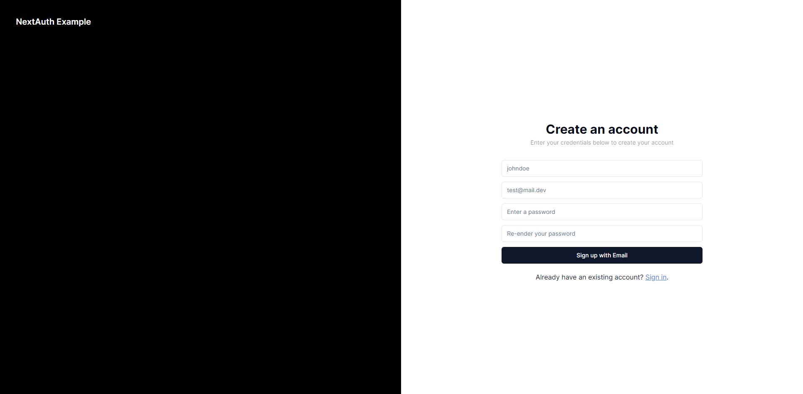
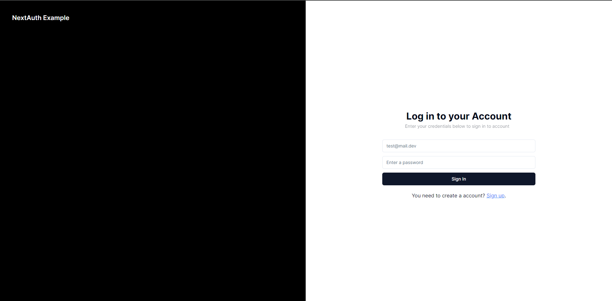

# NextAuth-Example
This is a simple example on how to use custom credentials on next-auth. I coded a custom login and registration form with the shadcn ui

### What to do?

1. Start with cloning this repository
```bash
git clone https://github.com/maxi-schaefer/NextAuth-Example
```

2. Install the needed dependencies
```bash
npm install
```

3. Change your **DATABASE_URL** and **NEXTAUTH_SECRET** in [.env](./.env)
```python
DATABASE_URL="POSTGRESQL_LINK"

# Next Auth variables
NEXTAUTH_SECRET = "SOME_RANDOM_STRING"
```

4. Start your development server
```bash
npm run dev
```

### Register


### Login
